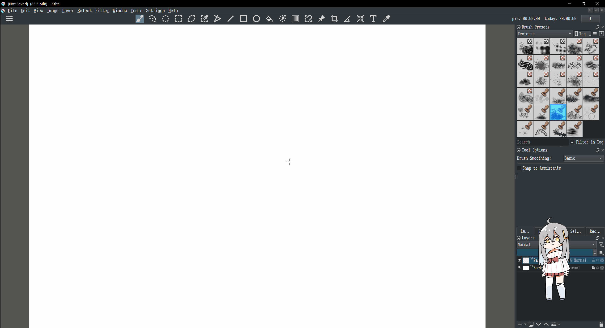
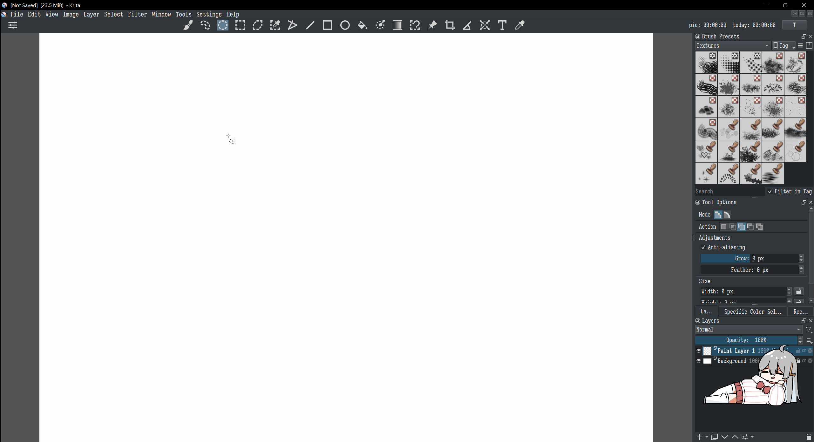

# Krita Popup

Provide a configurable Popup widget which can be triggered with shortcuts displaying under cursor or at specific locations. This plugin is determined to **minimalize hand movements** while painting, striking a balance between keyboard shortcuts and mouse. **still in development**.

This popup is configurable, Many type of widgets can be placed and configured on it, including:

1. [X] Tools
2. [X] Dockers those krita provided (multiple window support...?)
3. [x] Brushes
4. [ ] Current Layer States, like blending mode, opacity, inherit alpha, locked...
5. [ ] View States, like brush size, flow
6. [ ] (checkable) Actions like eraser mode, mirror.
7. [ ] A minimal tool option which will changes corresponding with current tool (mark: must get the shardtooldocker's widget in `__init__`)
8. [ ] other resources rather than brushes
9.  [X] main menu button
10. [ ] submenu within main menu like 'Filter'

# Install

1. Download this plugin as ZIP
2. Open krita, import the ZIP via `Tools-Scripts-Import Python Plugin From File`
3. restart, Check if plugin `Krita Popup` is active.

# Usage

1. Open an image (popup only can showed when any image opening)
2. Edit popup via `Tools-Krita Popup-Edit Popup X`. Add new item via the dropdown box on topLeft corner, edit and remove item by right click item. item can be moved and resized by mouse. Click `Apply` to apply configuration. Item will be displayed under cursor in default and you can configure it with `fixed` so it will be displayed fixed to screen.
3. Use shortcuts to toggle popup's display. By default, popup 0 binds to '\`'(left to number `1`), popup 1 binds to `CapsLock` and it's configurable in `Settings-Configure Krita...-Keyboard Shortcuts-Scripts-krita_popup_toggle`.

# TODO

1. [X] Add Widgets in editing mode
2. [X] Edit item (item specific)
3. [X] custom mask for items
4. [X] multiple layout 
5. [X] Fixed item (always displayed at specific locations nomatter where the cursor is)
6. Add Settings to popup (need to add a new class for handling popup's display)
   1. [ ] when cursor is very close to last position when popup is showed, show popup at the old position
   2. [ ] Add an "alive zone" (corresponding to "deadzone") to popup, limit the center's position
7. [ ] documentation
